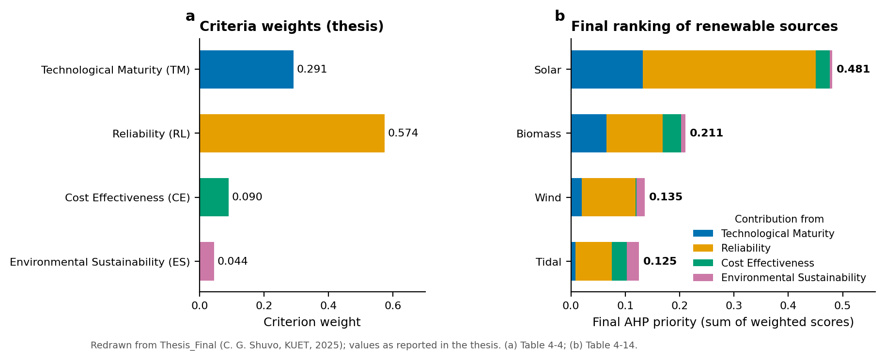
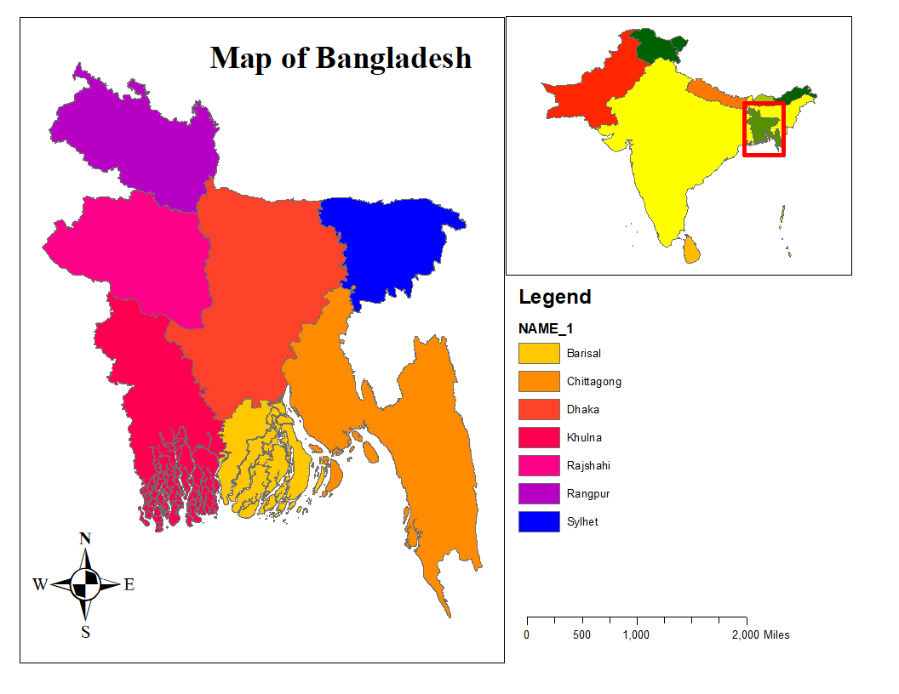
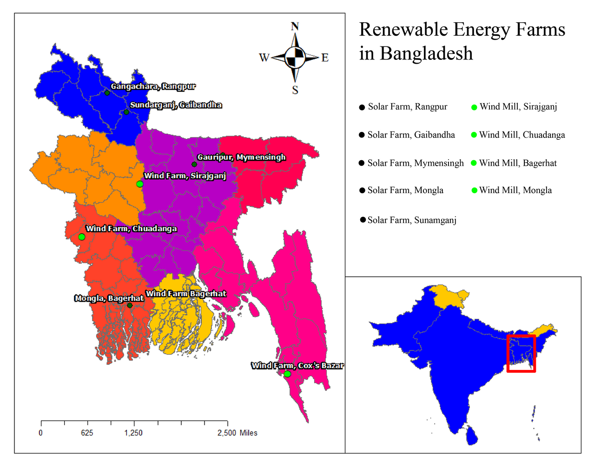
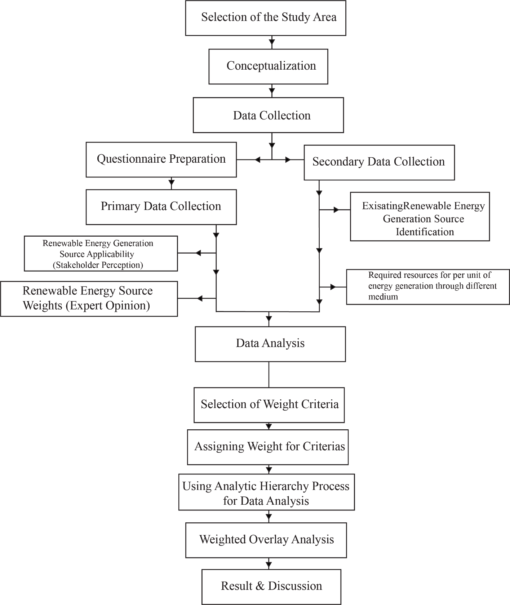
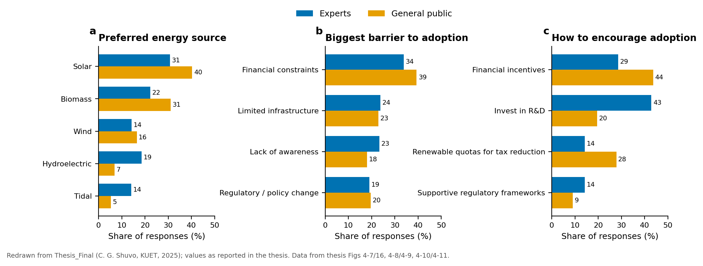

# Ranking Renewable Energy Sources for Bangladesh with the Analytic Hierarchy Process (AHP)

**Bachelor's thesis, Department of Urban and Regional Planning, Khulna University of Engineering & Technology (KUET), 2024**
Supervisor: Prof. Dr. Md. Mustafa Saroar · Individual work

## Summary

Bangladesh generates most of its electricity from fossil fuels, mainly natural gas. This thesis asks which renewable source the country should prioritise. I combined a questionnaire survey of the general public and sector experts with an Analytic Hierarchy Process (AHP) that scored four sources (solar, biomass, wind and tidal) against four criteria: technological maturity, reliability, cost-effectiveness and environmental sustainability. Solar ranked first by a wide margin. Both groups also named financial constraints as the biggest barrier to adoption.



## Study area

The study covers the whole of **Bangladesh** (20°34′–26°38′ N, 88°01′–92°41′ E, about 147,570 km²). A city-scale map focuses on **Sundarganj, Gaibandha**, the site of a 200 MW solar farm.

| National study area | Existing solar and wind farms |
|---|---|
|  |  |

## Data

| Data | Details |
|---|---|
| Primary survey | Questionnaires for the general public (convenience sample across income groups) and for sector experts, December 2023 – February 2024: **188 public and 21 expert responses** (counts from the survey chart data) |
| Expert pairwise judgements | Saaty 1–9 scale comparisons of the 4 criteria and 4 alternatives (questionnaire in the thesis appendix) |
| Installed capacity | Solar farm and wind-mill locations and capacities, compiled from published literature and agency reports (thesis Tables 4-1, 4-2) |

## Method



1. Reviewed the status of solar, wind, biomass, hydro and tidal energy in Bangladesh and mapped existing solar and wind farms.
2. Surveyed the public and experts on familiarity, preferences, barriers and policy options.
3. Built a three-level AHP hierarchy: goal → 4 criteria → 4 alternatives. Hydro was covered in the survey but not included in the AHP.
4. Built pairwise comparison matrices from expert judgements, normalised them and derived weights from the row averages.
5. Checked consistency with the consistency ratio (CR). The thesis reports λmax = 4.1683 and CR = 0.0624 for the criteria matrix.
6. Multiplied local weights by criterion weights and summed them to get a final priority for each source.

## Results

- **Final AHP priorities (Table 4-14):** Solar **0.481**, Biomass **0.211**, Wind **0.135**, Tidal **0.125**.
- In the thesis weights, **reliability** carried the most weight (0.574), followed by technological maturity (0.291), cost-effectiveness (0.090) and environmental sustainability (0.044). Solar's lead comes mostly from its reliability score.
- Both survey groups ranked solar first (experts 30.7%, public 40.3%) and biomass second (22.3%, 31.0%).
- **Financial constraints** were the most-cited barrier (public 39.4%, experts 33.8%). Experts favoured **R&D investment** (42.9%) as the way to encourage adoption, while the public favoured **financial incentives** (43.6%).



More results: [`images/survey-context.png`](images/survey-context.png). City-scale map: [`images/city-scale-area-sundarganj-gaibandha.png`](images/city-scale-area-sundarganj-gaibandha.png).

## Tools

- GIS mapping of the study area and renewable energy farms
- Microsoft Excel: survey tabulation and charts
- Python (pandas, matplotlib): redrawn figures in this repository. The code and the data taken from the thesis tables are in [`viz/`](viz/). Run `python viz/make_figures.py` to rebuild them.

## Repository contents

```
images/   maps and diagrams copied unchanged from the thesis, plus redrawn charts
viz/      make_figures.py and data/*.csv (values from the thesis tables and charts)
```

## Contact

Chinmoy Ghosh Shuvo · Open to collaboration and knowledge sharing. Feel free to reach out on [LinkedIn](https://www.linkedin.com/in/chinmoyghosh034).
